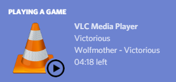

# vlc-discord-rpc
Discord rich presence for VLC media player.



Join us on [Discord](https://discord.gg/3Fu6KHd).

## Requirements
- [NodeJS and NPM](https://nodejs.org/en/)
- [VLC](https://www.videolan.org/index.html)
- [Discord desktop client](https://discordapp.com/)

## Start
 1. [Download the latest release for your platform](https://github.com/Pigpog/vlc-discord-rpc/releases)
 2. Unzip the file
 3. Launch the start file.

*NOTE: You must close all existing instances of VLC before running in default mode.*

If you installed VLC to a strange place, you will need to edit the path of VLC in [config/config.js](./config/config.js).

## *Optional*

### Run Detached (Best Experience)
Detached mode brings all of the following:
 - VLC will not open automatically when the script starts
 - The script will not close when VLC closes (runs constantly)
 - You can use your usual VLC shortcuts
 - In default mode, you must open VLC first and then load media. This is not the case in detached mode.

##### Command:
```
npm start detached
```
You must [manually configure](./CONFIGURATION.md) to use this mode.

A more permanent solution could be to change the `npm start` command in your respective start script to this detached mode command, or change [package.json](https://github.com/Pigpog/vlc-discord-rpc/blob/886e54260a55dd70d1f899e357c4b63b8f6f4578/package.json#L12)'s command to `"start": "node ./src/app.js detached",`

### Configuration
[config/config.js](./config/config.js) may need to be modified if:
 - Your system uses an abnormal VLC install
 - You have manually configured your VLC web interface

Please see [CONFIGURATION.md](./CONFIGURATION.md) to learn more about manual configuration.

### Limitations
 - When running multiple concurrent instances, only first-opened instance of VLC will have a rich presence
 - The rich presence cannot display album art
